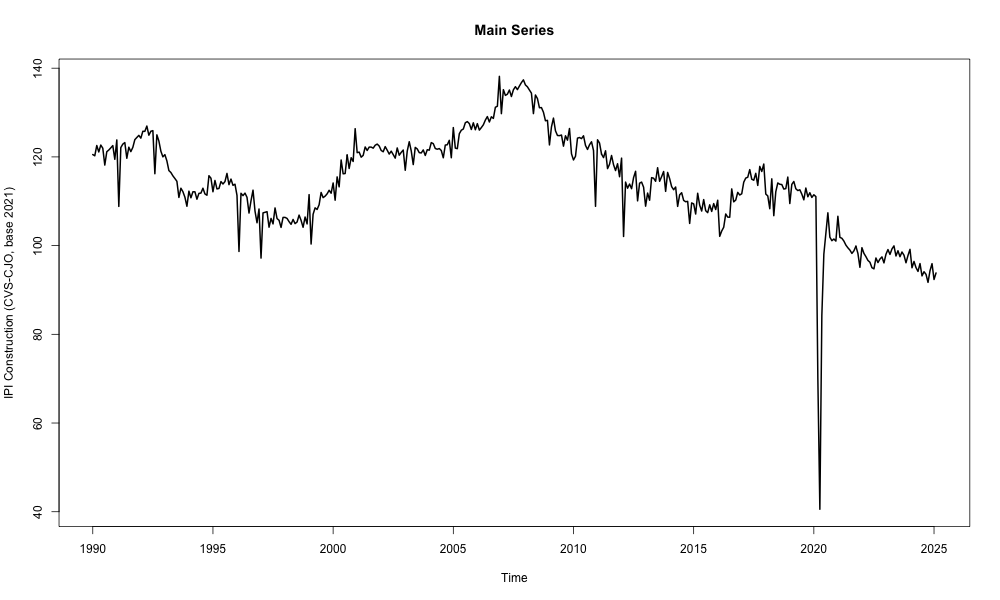

# Linear Time Series

This project analyzes the time series of the Industrial Production Index (IPI) for the construction sector in France (Section F of the NAF classification), covering the period from January 1990 to February 2025. The goal is to model and forecast the series using ARMA/ARIMA models while addressing issues such as non-stationarity, outliers, and external shocks.

The GitHub repository is organized as follows:

```
.
├── assignment.pdf     # Project instructions and topic
├── code.R             # Full R code used for data processing, modeling, and forecasting
├── report.pdf         # Detailed project report with analysis and results
├── data.csv           # Dataset: Industrial Production Index (construction sector)
└── README.md          # Project documentation
```

## Data

- **Source**: INSEE ([Link to series](https://www.insee.fr/fr/statistiques/serie/010767635))
- **Frequency**: Monthly
- **Timeframe**: January 1990 to February 2025 (422 observations)
- **Preprocessing**: Seasonally and working-day adjusted (CVS-CJO)
- **Base year**: 2021



## Features

- Exploratory and graphical analysis of the series
- Stationarity testing (ADF, PP, KPSS)
- Detection and treatment of outliers
- Optimal ARIMA(p,d,q) model selection
- Forecasting with 95% confidence intervals
- Instantaneous causality analysis (Granger)

## Installation

1. Clone the repository:

   ```bash
   git clone https://github.com/nayelsdk/time-series-project.git
   cd time-series-project
   ```

2. Install the required R packages:
   ```r
   install.packages(c("forecast", "tseries", "fUnitRoots", "ggplot2", "tsoutliers", "ellipse", "astsa"))
   ```

## Forecasting

- **Horizon**: March 2025 and April 2025
- **Point forecasts**:
  - **March**: 93.86 [85.77 ; 101.95]
  - **April**: 93.87 [84.99 ; 102.74]
- **Visualization**: Zoomed-in plot and 2D confidence ellipse

## Dependencies

- R ≥ 4.0
- Packages: `forecast`, `ggplot2`, `fUnitRoots`, `tseries`, `zoo`, `astsa`, `tsoutliers`, `ellipse`, `RColorBrewer`, `gridExtra`, `scales`

## Authors

- [Ana-Sofia Cianfarani](https://www.linkedin.com/in/as-cianfarani/)
- [BENABDESADOK Nayel](https://www.linkedin.com/in/nayel-benabdesadok)
